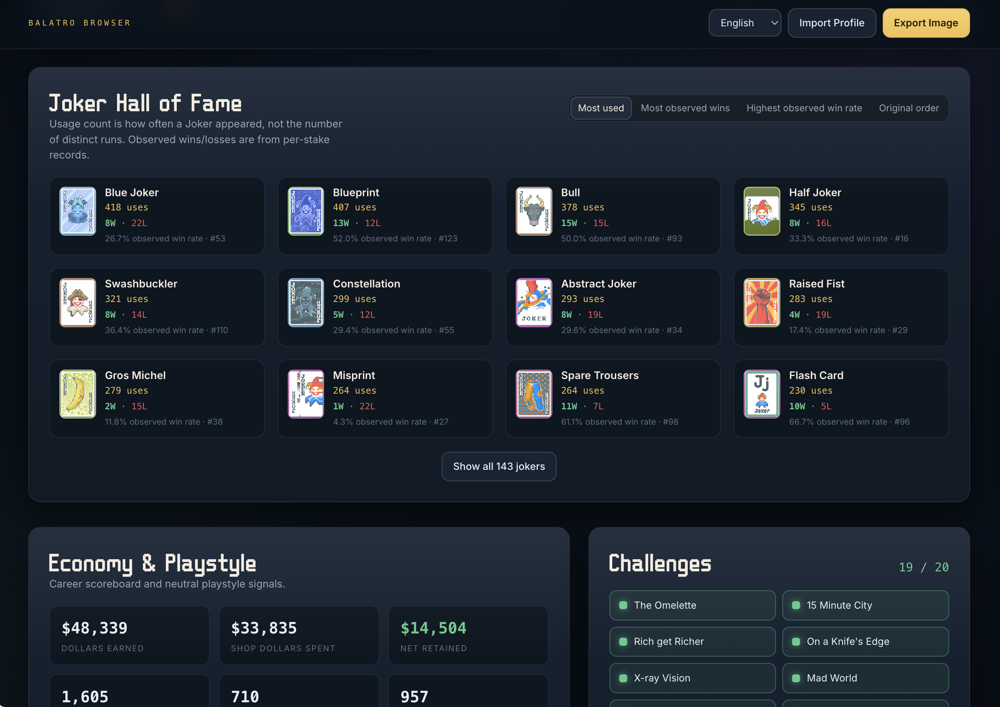

# Balatro Browser

> **语言 / Languages:** [English](README.md) · 简体中文

把 Balatro 个人存档变成一份可浏览、可分享的生涯档案页。

纯前端 SPA，导入 `profile.json` 或 `profile.jkr` 后在本地浏览器解析展示，**不上传任何数据**。



## 功能

- **生涯概览** — 总胜场 / 败场、胜率、最佳手牌、单局最高金钱
- **收藏进度** — 牌组 stake、小丑贴纸、挑战完成度
- **牌组档案** — 各牌组胜负、最高 stake、stake 分布，支持排序与详情抽屉
- **牌组使用排行 & 手牌画像** — 最常玩牌组、手牌类型偏好
- **小丑名人堂** — 使用次数与观测胜负
- **经济统计** — 生涯金钱曲线相关数据
- **挑战 & 排行榜** — 官方挑战名、消耗品 / 优惠券使用排行
- **导出图片** — 一键导出当前档案页为 PNG
- **多语言** — 界面与游戏术语支持 简体中文 / 繁体中文 / English / 日本語 / 한국어

## 快速开始

```bash
bun install
bun dev
```

浏览器打开终端提示的本地地址，拖入存档文件即可。

### 构建与预览

```bash
bun run typecheck   # TypeScript 检查
bun run lint        # ESLint
bun run build       # 生产构建
bun run preview     # 预览构建产物
```

## 如何获取存档

支持以下格式：

| 文件 | 说明 |
|------|------|
| `profile.json` | 解密 `profile.jkr` 获得的文件 |
| `profile.jkr` | 游戏默认压缩存档（会自动解压解析） |

常见存档位置（可直接上传对应文件）：

- **macOS**：`~/Library/Application Support/Balatro/`
- **macOS (Apple Arcade)**：`~/Library/Containers/com.playstack.balatroarcade/Data/Library/Preferences/com.playstack.balatroarcade.plist`
- **Windows**：`%AppData%/Balatro/`
- **Linux**：`~/.local/share/Balatro/` 或 Steam 对应目录

### Apple Arcade 版 Balatro

如果你使用 Apple Arcade 版本，存档文件为 `com.playstack.balatroarcade.plist`，可以使用 [export-balatro-jkr.py](https://gist.github.com/RealTong/a11cbeda965292e8e889f7cbab68c60d) 来获取 `profile.jkr`，然后导入本工具。

## 隐私

所有解析与渲染均在浏览器内完成，不连接后端，不发送存档内容。

## 技术栈

- React 19 + TypeScript + Vite 8
- Tailwind CSS 4
- [pako](https://github.com/nodeca/pako) — `.jkr` 解压
- [html-to-image](https://github.com/bubkoo/html-to-image) — 页面截图导出

小丑等卡牌缩略图来自 [Balatro Wiki](https://balatrowiki.org/)（`balatrowiki.org/images/`），加载失败时回退为占位样式。

## 项目结构

```
src/
├── App.tsx                 # 导入路由、locale、导出
├── lib/
│   ├── profile.ts          # 存档类型与派生统计
│   ├── format.ts           # 大数 / 科学计数法格式化
│   ├── gameData.ts         # stake、牌组色、wiki 图片 URL
│   ├── uiText.tsx          # 界面文案 i18n
│   ├── balatroLocale*.ts   # 游戏内术语本地化
│   ├── challengeNames.ts   # 官方挑战名称
│   └── jkrFile.ts          # .jkr / .jks 解析
└── components/profile/     # 各档案区块 UI
```

## 许可与声明

本项目为粉丝工具，与 LocalThunk / Playstack 无官方关联。Balatro 及相关资产归其权利人所有。
